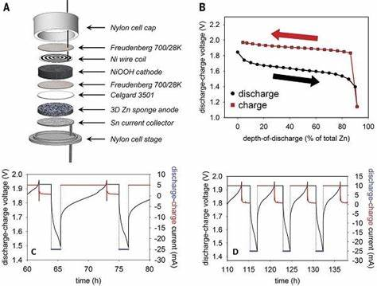

# Zn_Battery_SOC_Analysis
## Author: Haibin Lai

Abstract: This article provides a detailed overview of the preparation and testing processes for zinc-zinc half-cells and pouch batteries. Firstly, zinc-zinc half-cell configurations are thoroughly examined, including principles of composition, required materials for preparation, and specific operational procedures. Subsequently, the fabrication process of pouch batteries is described in detail, accompanied by pertinent preparation steps and considerations. Supported by flowcharts, the detailed procedures for both battery types are outlined, emphasizing key details to observe during experimentation. Finally, through test and analysis summaries, the performance and significant findings of the experiments are evaluated, offering valuable reference points for future research and applications. This article aims to provide readers with clear operational guidelines and comprehensive experimental data analysis to support further exploration and applications in the field of battery research and development.

 * Online document available: [【金山文档】 SDIM 101 SOP]

[【金山文档】 SDIM 101 SOP]: https://p.kdocs.cn/s/MFYCKKQ2ABADA

* Github: https://github.com/HaibinLai/Zn_Battery_SOC_Analysis

SOP：SDIM 101 电池制作SOP.md
https://haibinlai.github.io/Zn_Battery_SOC_Analysis/SDIM%20101%20%E7%94%B5%E6%B1%A0%E5%88%B6%E4%BD%9CSOP
